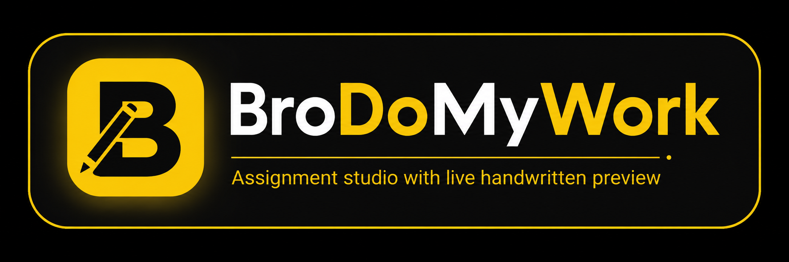

# BroDoMyWork

<p align="center">
  
</p>

<p align="center">
  
  
  
  
  
</p>

---

## About the project

**BroDoMyWork** is a full‑stack app that generates a **handwritten-looking assignment PDF** from a PDF/image you upload.
It’s built as a simple guided workflow (upload → pick paper & handwriting → add your info → generate → download).

### Why it’s useful

- **Works for both digital + scanned PDFs**: uses embedded text when available, otherwise renders pages and runs OCR.
- **Configurable output**: choose paper template, handwriting font, subject, difficulty level, and writing style.
- **End-to-end in one click**: once generation completes, you download the final PDF from the backend.
- **Poppler-free**: PDF rendering uses PyMuPDF, so you don’t need Poppler on your system.

## How it works

```
Upload PDF/image
    ↓
OCR extracts text
  • Digital PDF  → pypdf (instant, no render needed)
  • Scanned PDF  → PyMuPDF renders pages → Tesseract OCR
  • Tables       → pdfplumber extracts separately
    ↓
Questions are segmented (regex + spaCy fallback)
    ↓
GPT generates human-like answers
  (subject, difficulty level, writing style — all configurable)
    ↓
Pillow renders pages in chosen handwriting font + paper template
    ↓
img2pdf assembles the final PDF  →  Download
```

---

## Tech stack

| Layer | Technology |
|---|---|
| Frontend | React 18, TypeScript, Vite 5, Tailwind CSS |
| Backend | FastAPI, Uvicorn, Python 3.11 |
| PDF extraction | **pypdf** (digital text), **PyMuPDF** (render to images), **pdfplumber** (tables) |
| OCR | **Tesseract**, OpenCV pre-processing |
| AI generation | **OpenAI** chat completions (`gpt-3.5-turbo` by default) |
| Handwriting render | **Pillow** (PIL) — 6 fonts × 6 paper templates |
| PDF assembly | **img2pdf** |
| NLP | **spaCy** (`en_core_web_sm`) for sentence segmentation fallback |

> **No Poppler required** — `pdf2image` has been fully replaced by PyMuPDF.

---

## Quick start

### Prerequisites

| Requirement | Notes |
|---|---|
| Node.js 18+ | Frontend build |
| Python 3.10+ (3.11 recommended) | Backend |
| Tesseract OCR | [Install guide](https://github.com/tesseract-ocr/tesseract) — must be on PATH or set `TESSERACT_CMD` in `.env` |
| OpenAI API key | [platform.openai.com](https://platform.openai.com) |

---

### 1 — Backend

**Windows (PowerShell)**

```powershell
cd backend
python -m venv venv
venv\Scripts\activate
pip install -r requirements.txt
python -m spacy download en_core_web_sm
copy .env.example .env
# Open .env and set OPENAI_API_KEY=sk-...
python setup_fonts.py        # downloads handwriting TTF fonts (recommended)
uvicorn main:app --reload --port 8000
```

**macOS / Linux**

```bash
cd backend
python -m venv venv
source venv/bin/activate
pip install -r requirements.txt
python -m spacy download en_core_web_sm
cp .env.example .env
# Open .env and set OPENAI_API_KEY=sk-...
python setup_fonts.py
uvicorn main:app --reload --port 8000
```

- API: `http://localhost:8000`
- Swagger docs: `http://localhost:8000/docs`

---

### 2 — Frontend

```bash
cd frontend
npm install
npm run dev
```

Open `http://localhost:5173`.

All `/api/*` requests are automatically proxied to `http://localhost:8000` via `vite.config.ts` — no CORS setup needed in development.

---

## Environment variables (`backend/.env`)

| Variable | Default | Description |
|---|---:|---|
| `OPENAI_API_KEY` | **required** | Your OpenAI secret key |
| `HOST` | `0.0.0.0` | Uvicorn bind address |
| `PORT` | `8000` | Uvicorn port |
| `DEBUG` | `false` | Enables debug logging; `python main.py` also respects `--reload` |
| `OUTPUT_DIR` | `output` | Directory for generated PDFs and intermediate PNGs |
| `MAX_FILE_SIZE` | `10485760` | Upload size limit in bytes (default 10 MB) |
| `TESSERACT_CMD` | *(PATH)* | Full path to `tesseract` binary if not on system PATH |

---

## API endpoints

| Method | Endpoint | Description |
|---|---|---|
| `POST` | `/api/upload` | Upload PDF or image → OCR → returns `session_id` + extracted questions |
| `POST` | `/api/generate-answers` | Generate GPT answers for the extracted questions |
| `POST` | `/api/render-assignment` | Render handwriting pages → assemble PDF |
| `GET` | `/api/status/{session_id}` | Check current step and progress percentage |
| `GET` | `/api/download/{session_id}` | Download the finished PDF |
| `DELETE` | `/api/cleanup/{session_id}` | Delete session data and all generated files |

Interactive docs at `http://localhost:8000/docs`.

---

## Docker (backend)

```bash
cd backend
docker build -t assignmentai-backend .
docker run -p 8000:8000 -e OPENAI_API_KEY=sk-... assignmentai-backend
```

> Tesseract is bundled in the Docker image. Poppler is **not** installed.

---

## Handwriting fonts

The renderer uses Google handwriting fonts stored in `backend/assets/fonts/`. Download them with:

```bash
cd backend
python setup_fonts.py
```

If fonts are missing the backend falls back to PIL's built-in default font (functional but not realistic).

| Font style | File |
|---|---|
| Caveat | `Caveat-Regular.ttf` |
| Dancing Script | `DancingScript-Regular.ttf` |
| Patrick Hand | `PatrickHand-Regular.ttf` |
| Indie Flower | `IndieFlower-Regular.ttf` |
| Kalam | `Kalam-Regular.ttf` |
| Shadows Into Light | `ShadowsIntoLight-Regular.ttf` |

---

## Paper templates

Six templates are available in the UI and rendered by `HandwritingService`:

`ruled` · `double-ruled` · `notebook` · `graph` · `dotted` · `blank`

---

## Project structure

```
.
├── backend/
│   ├── main.py                         # FastAPI app — routes, env wiring, session store
│   ├── models/
│   │   └── schemas.py                  # Pydantic request/response models + enums
│   ├── services/
│   │   ├── ocr_service.py              # pypdf → PyMuPDF/Tesseract → pdfplumber pipeline
│   │   ├── llm_service.py              # OpenAI answer generation with style prompting
│   │   ├── handwriting_service.py      # Pillow page rendering (fonts + templates)
│   │   └── pdf_service.py              # img2pdf PDF assembly + image cleanup
│   ├── assets/
│   │   └── fonts/                      # Handwriting TTF files (downloaded by setup_fonts.py)
│   ├── output/                         # Runtime-generated PDFs (gitignored)
│   ├── setup_fonts.py                  # Downloads Google handwriting fonts
│   ├── requirements.txt
│   └── Dockerfile
├── frontend/
│   ├── src/
│   │   ├── App.tsx                     # 6-step wizard: upload → template → font → info → generate
│   │   ├── index.css                   # Design tokens (CSS vars), Tailwind layers, Google Fonts
│   │   ├── services/
│   │   │   └── api.ts                  # Typed fetch client for all backend endpoints
│   │   └── components/
│   │       ├── LandingPage.tsx         # Hero + how-it-works + features + CTA
│   │       ├── BroLogo.tsx             # Brand mark
│   │       ├── ThemeToggle.tsx         # Light / dark toggle
│   │       ├── StepNavigation.tsx      # Sidebar wizard progress
│   │       ├── InteractiveFileUpload.tsx
│   │       ├── InteractiveTemplateSelector.tsx
│   │       ├── InteractiveFontSelector.tsx
│   │       ├── InteractiveUserForm.tsx  # Name, roll no, subject, difficulty, writing style
│   │       └── GenerationInterface.tsx  # Calls real API; shows step progress + download
│   ├── vite.config.ts                  # Dev-server proxy: /api → localhost:8000
│   └── package.json
├── requirements.txt                    # Same as backend/requirements.txt (for CI)
└── README.md
```

---

## Troubleshooting

### "Backend server not reachable" banner in the app

Start the backend first:

```bash
cd backend && uvicorn main:app --reload --port 8000
```

### Tesseract not found / OCR returns empty text

1. Install Tesseract: [install guide](https://github.com/tesseract-ocr/tesseract)
2. Verify: `tesseract --version`
3. If it's not on PATH, add to `backend/.env`:
   ```
   TESSERACT_CMD=C:\Program Files\Tesseract-OCR\tesseract.exe
   ```

### PDF text extraction is empty or garbled

- **Digital PDF** → handled by pypdf; make sure the PDF isn't password-protected
- **Scanned PDF** → falls back to PyMuPDF → Tesseract; quality depends on scan resolution
- Use 300 DPI+ scans for best OCR results

### Handwriting looks generic / plain

Run `python setup_fonts.py` inside the `backend/` folder and confirm the six `.ttf` files appear in `backend/assets/fonts/`.
